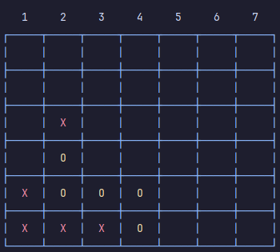

## Java Connect 4

A simple Connect 4 game made in *Java*. It has two bot models, a Minimax algorithm (really good) and a atrociusly bad random model.

### Instructions

At launch the game will prompt you if your terminal supports ANSI, if so select yes by enetering the corresponding number.

Then you will be met with the model selection screen, simply select which one you want to challenge.

The gameplay is a loop, select which column you would like to drop your piece in, let the bot do it's move and repeat until the game end.

### Preview

